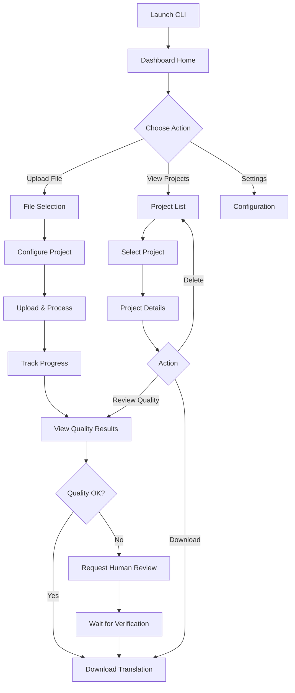

# Straker Verify CLI Dashboard - Project Plan

## Project Overview

An Interactive Translation Quality Dashboard built as a modern Terminal User Interface (TUI) application using Python, Rich, and Textual. This demo showcases the Straker Verify API's capabilities for translation quality evaluation, human verification, and project management.

## Core Features

### 1. Dashboard Home Screen
- **Live Project Overview**: Display active projects with status indicators
- **Quick Stats Panel**: Show total projects, files processed, average quality scores
- **Recent Activity Feed**: Real-time updates on translation progress
- **Token Balance Display**: Show remaining API credits

### 2. File Upload & Project Creation
- **Interactive File Selection**: Browse and select files for translation
- **Project Configuration**: 
  - Source and target language selection
  - Project name and description
  - Workflow selection (quality evaluation, human verification, etc.)
- **Batch Upload Support**: Upload multiple files at once
- **Progress Indicators**: Real-time upload progress with Rich progress bars

### 3. Quality Metrics Visualization
- **Overall Quality Score**: Large, prominent display of project quality rating
- **Segment-Level Analysis**: Detailed breakdown of translation quality by segment
- **Quality Dimensions**: Display scores for:
  - Accuracy
  - Fluency
  - Terminology
  - Style
- **Terminal-Based Charts**: Use Rich/Textual to create visual representations
- **Trend Analysis**: Track quality improvements over time

### 4. Translation Review Interface
- **Side-by-Side Comparison**: Source and target text display
- **Segment Navigation**: Browse through translation segments
- **Quality Highlights**: Color-coded quality indicators per segment
- **Issue Identification**: Highlight problematic segments
- **Export Reports**: Generate quality reports in various formats

### 5. Human Verification Workflow
- **Request Human Review**: Submit projects for human verification
- **Status Tracking**: Monitor verification progress
- **Notification System**: Alert when human verification is complete
- **Before/After Comparison**: Compare AI vs human-verified translations

### 6. Project Management
- **Project List View**: Sortable, filterable list of all projects
- **Project Details**: Comprehensive view of project metadata
- **File Management**: Download translated files
- **Project History**: Track all actions and changes
- **Search Functionality**: Find projects by name, language, or status

## Technical Architecture

### Technology Stack
```
- Python 3.9+
- straker-verify: Official Straker Verify Python SDK
- textual: Modern TUI framework
- rich: Terminal formatting and styling
- httpx: Async HTTP client (if needed beyond SDK)
- python-dotenv: Environment variable management
- pydantic: Data validation and settings management
```

### Project Structure
```
straker-verify-dashboard/
├── src/
│   ├── __init__.py
│   ├── main.py                 # Entry point
│   ├── app.py                  # Main Textual application
│   ├── config.py               # Configuration management
│   ├── api/
│   │   ├── __init__.py
│   │   ├── client.py           # Straker Verify API wrapper
│   │   └── models.py           # Data models
│   ├── screens/
│   │   ├── __init__.py
│   │   ├── dashboard.py        # Main dashboard screen
│   │   ├── upload.py           # File upload screen
│   │   ├── project_detail.py  # Project details screen
│   │   ├── quality_review.py  # Quality review screen
│   │   └── settings.py         # Settings screen
│   ├── widgets/
│   │   ├── __init__.py
│   │   ├── project_card.py    # Project display widget
│   │   ├── quality_chart.py   # Quality visualization widget
│   │   ├── progress_panel.py  # Progress tracking widget
│   │   └── stats_panel.py     # Statistics widget
│   └── utils/
│       ├── __init__.py
│       ├── formatters.py      # Text formatting utilities
│       └── validators.py      # Input validation
├── tests/
│   ├── __init__.py
│   ├── test_api.py
│   └── test_widgets.py
├── examples/
│   ├── sample_en.txt
│   ├── sample_es.txt
│   └── README.md
├── .env.example
├── .gitignore
├── requirements.txt
├── setup.py
├── README.md
└── PLAN.md
```

### Key Components

#### 1. API Client Wrapper (`api/client.py`)
```python
class StrakerVerifyClient:
    - initialize(api_key)
    - get_languages()
    - create_project(config)
    - upload_file(project_id, file_path)
    - get_project_status(project_id)
    - get_quality_evaluation(project_id)
    - request_human_verification(project_id)
    - download_file(file_id)
    - get_token_balance()
    - list_projects()
```

#### 2. Main Application (`app.py`)
```python
class StrakerVerifyApp(App):
    - CSS styling for TUI
    - Screen management
    - Global state management
    - Keyboard shortcuts
    - Theme configuration
```

#### 3. Dashboard Screen (`screens/dashboard.py`)
```python
class DashboardScreen(Screen):
    - Project overview grid
    - Quick stats panel
    - Recent activity log
    - Navigation menu
    - Refresh functionality
```

#### 4. Quality Visualization (`widgets/quality_chart.py`)
```python
class QualityChart(Widget):
    - Render quality scores as bar charts
    - Color-coded quality indicators
    - Segment-level breakdown
    - Interactive hover details
```

## User Flow



## Implementation Phases

### Phase 1: Foundation (Tasks 1-4)
- Research Straker Verify API endpoints and workflows
- Design application architecture and data models
- Set up project structure with proper Python packaging
- Create requirements.txt and development environment

### Phase 2: Core API Integration (Task 5)
- Implement Straker Verify client wrapper
- Add authentication and error handling
- Create data models for projects, files, and quality metrics
- Write unit tests for API client

### Phase 3: TUI Framework (Tasks 6-8)
- Build main Textual application shell
- Create dashboard layout with panels
- Implement file upload interface
- Add project creation and configuration screens

### Phase 4: Quality Features (Tasks 9-11)
- Add real-time progress tracking
- Build quality metrics visualization
- Create segment-level review interface
- Implement quality score calculations and displays

### Phase 5: Advanced Features (Tasks 12-13)
- Add human verification workflow
- Implement project history tracking
- Create statistics and analytics views
- Add export functionality

### Phase 6: Polish & Documentation (Tasks 14-16)
- Create configuration management system
- Write comprehensive README
- Add example files and tutorials
- Create demo video/screenshots

## Key Features Breakdown

### Dashboard Components

1. **Header Bar**
   - App title and version
   - Current user/API key status
   - Token balance indicator
   - Clock/timestamp

2. **Stats Panel** (Top)
   - Total Projects: `[12]`
   - Active Jobs: `[3]`
   - Avg Quality: `[87.5%]`
   - Files Processed: `[45]`

3. **Project Grid** (Center)
   - Card-based layout showing recent projects
   - Each card displays:
     - Project name
     - Language pair (EN → ES)
     - Status badge (Processing/Complete/Failed)
     - Quality score (if available)
     - Last updated timestamp

4. **Activity Feed** (Right Sidebar)
   - Real-time updates
   - Color-coded by event type
   - Scrollable history

5. **Action Menu** (Bottom)
   - `[N]ew Project`
   - `[U]pload File`
   - `[P]rojects`
   - `[S]ettings`
   - `[Q]uit`

### Quality Review Screen

```
┌─ Translation Quality Review ─────────────────────────────────┐
│ Project: Marketing_Campaign_ES                                │
│ Language: English → Spanish                                   │
│ Overall Score: ████████░░ 87.5%                              │
├───────────────────────────────────────────────────────────────┤
│                                                               │
│ Quality Dimensions:                                           │
│   Accuracy:     ██████████ 92%                               │
│   Fluency:      ████████░░ 85%                               │
│   Terminology:  █████████░ 88%                               │
│   Style:        ████████░░ 84%                               │
│                                                               │
├───────────────────────────────────────────────────────────────┤
│ Segment Analysis (3 of 45):                                   │
│                                                               │
│ [Source]                                                      │
│ "Welcome to our new product launch event."                    │
│                                                               │
│ [Translation] Quality: 95%                                    │
│ "Bienvenido a nuestro evento de lanzamiento de producto."   │
│                                                               │
│ ◄ Previous | Next ► | [R]equest Human Review | [E]xport     │
└───────────────────────────────────────────────────────────────┘
```

## Configuration Management

### Environment Variables (.env)
```
STRAKER_VERIFY_API_KEY=your_api_key_here
STRAKER_VERIFY_BASE_URL=https://api-verify.straker.ai
DEFAULT_SOURCE_LANGUAGE=en
DEFAULT_TARGET_LANGUAGE=es
CACHE_ENABLED=true
CACHE_TTL=3600
LOG_LEVEL=INFO
```

### User Preferences
- Theme selection (dark/light)
- Default languages
- Auto-refresh interval
- Notification preferences
- Export format preferences

## Error Handling Strategy

1. **API Errors**
   - Network timeouts: Retry with exponential backoff
   - Authentication failures: Prompt for new API key
   - Rate limiting: Display wait time and queue requests
   - Invalid requests: Show user-friendly error messages

2. **File Errors**
   - Unsupported formats: List supported formats
   - File too large: Show size limits
   - Upload failures: Retry mechanism with progress

3. **UI Errors**
   - Graceful degradation for terminal size issues
   - Fallback displays for unsupported features
   - Clear error messages with recovery suggestions

## Testing Strategy

1. **Unit Tests**
   - API client methods
   - Data model validation
   - Utility functions

2. **Integration Tests**
   - End-to-end API workflows
   - File upload/download
   - Project lifecycle

3. **UI Tests**
   - Screen rendering
   - Widget interactions
   - Keyboard navigation

## Success Metrics

- ✅ Successfully upload and process files through Straker Verify
- ✅ Display quality metrics in an intuitive, visual format
- ✅ Enable human verification workflow
- ✅ Provide smooth, responsive TUI experience
- ✅ Handle errors gracefully with helpful messages
- ✅ Easy setup and configuration (< 5 minutes)
- ✅ Comprehensive documentation and examples

## Future Enhancements

1. **Batch Processing**: Process multiple files in parallel
2. **Webhooks**: Real-time notifications for project updates
3. **Custom Workflows**: Define custom quality evaluation workflows
4. **Export Options**: PDF reports, CSV data exports
5. **Comparison Mode**: Compare multiple translation versions
6. **AI Insights**: Use LLM to provide translation improvement suggestions
7. **Team Features**: Multi-user support with role-based access
8. **Analytics Dashboard**: Historical trends and insights

## Notes

- Focus on creating a polished, professional demo that showcases Straker Verify's capabilities
- Prioritize user experience with smooth animations and clear feedback
- Use Rich's styling capabilities to create an attractive, modern interface
- Ensure the app works well in various terminal sizes (minimum 80x24)
- Include helpful tooltips and keyboard shortcuts throughout
- Make the app easy to run with minimal setup (just API key required)