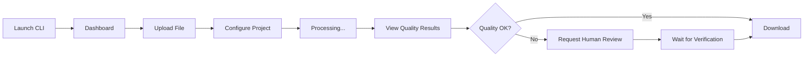

# Straker Verify CLI Dashboard - Project Summary

## 🎯 Project Goal

Build an **Interactive Translation Quality Dashboard** as a modern Terminal User Interface (TUI) that showcases the Straker Verify API's capabilities for translation quality evaluation, human verification, and project management.

## 🚀 What We're Building

A beautiful, feature-rich CLI application that allows users to:

1. **Upload files** for translation quality evaluation
2. **Track progress** in real-time with live updates
3. **Visualize quality metrics** with terminal-based charts and graphs
4. **Review translations** segment-by-segment with quality scores
5. **Request human verification** when AI quality isn't sufficient
6. **Manage projects** with a comprehensive dashboard interface

## 💻 Technology Stack

```
Python 3.9+
├── straker-verify    # Official Straker Verify Python SDK
├── textual          # Modern TUI framework (like React for terminals)
├── rich             # Beautiful terminal formatting and styling
├── httpx            # Async HTTP client (if needed)
├── python-dotenv    # Environment variable management
└── pydantic         # Data validation and settings
```

## 🎨 User Interface Preview

### Main Dashboard
```
╔══════════════════════════════════════════════════════════════════╗
║  Straker Verify Dashboard                    Balance: 1,250 ⚡   ║
╠══════════════════════════════════════════════════════════════════╣
║                                                                  ║
║  📊 Quick Stats                                                  ║
║  ┌────────────┬────────────┬────────────┬────────────┐         ║
║  │ Projects   │ Active     │ Avg Quality│ Files      │         ║
║  │    12      │     3      │   87.5%    │    45      │         ║
║  └────────────┴────────────┴────────────┴────────────┘         ║
║                                                                  ║
║  📁 Recent Projects                                              ║
║  ┌──────────────────────────────────────────────────┐          ║
║  │ Marketing_Campaign_ES          EN→ES  ✓ Complete │          ║
║  │ Quality: ████████░░ 87%        2 hours ago       │          ║
║  └──────────────────────────────────────────────────┘          ║
║  ┌──────────────────────────────────────────────────┐          ║
║  │ Product_Docs_FR               EN→FR  ⟳ Processing│          ║
║  │ Progress: ████░░░░░░ 45%      5 mins ago         │          ║
║  └──────────────────────────────────────────────────┘          ║
║                                                                  ║
║  [N]ew Project  [U]pload  [P]rojects  [S]ettings  [Q]uit       ║
╚══════════════════════════════════════════════════════════════════╝
```

### Quality Review Screen
```
╔══════════════════════════════════════════════════════════════════╗
║  Translation Quality Review - Marketing_Campaign_ES              ║
╠══════════════════════════════════════════════════════════════════╣
║                                                                  ║
║  Overall Score: ████████░░ 87.5%                                ║
║                                                                  ║
║  Quality Dimensions:                                             ║
║    Accuracy:     ██████████ 92%  ✓ Excellent                   ║
║    Fluency:      ████████░░ 85%  ⚠ Good                        ║
║    Terminology:  █████████░ 88%  ✓ Very Good                   ║
║    Style:        ████████░░ 84%  ⚠ Good                        ║
║                                                                  ║
║  ─────────────────────────────────────────────────────────────  ║
║                                                                  ║
║  Segment 3 of 45                                                 ║
║                                                                  ║
║  [Source - English]                                              ║
║  "Welcome to our new product launch event."                      ║
║                                                                  ║
║  [Translation - Spanish] Quality: 95% ✓                         ║
║  "Bienvenido a nuestro evento de lanzamiento de producto."     ║
║                                                                  ║
║  ◄ Previous | Next ► | [R]equest Human Review | [E]xport       ║
╚══════════════════════════════════════════════════════════════════╝
```

## 🔄 User Workflow



## 📦 Project Structure

```
straker-verify-dashboard/
├── src/
│   ├── main.py              # Entry point
│   ├── app.py               # Main Textual application
│   ├── config.py            # Configuration management
│   ├── api/
│   │   ├── client.py        # Straker Verify API wrapper
│   │   └── models.py        # Data models
│   ├── screens/
│   │   ├── dashboard.py     # Main dashboard
│   │   ├── upload.py        # File upload
│   │   ├── project_detail.py
│   │   └── quality_review.py
│   ├── widgets/
│   │   ├── project_card.py
│   │   ├── quality_chart.py
│   │   └── stats_panel.py
│   └── utils/
│       ├── formatters.py
│       └── validators.py
├── examples/
│   └── sample files...
├── requirements.txt
├── README.md
└── .env.example
```

## ✨ Key Features

### 1. Dashboard Home
- Live project overview with status indicators
- Quick stats (projects, quality scores, files processed)
- Recent activity feed with real-time updates
- Token balance display

### 2. File Upload & Project Creation
- Interactive file selection
- Language pair configuration
- Workflow selection (quality evaluation, human verification)
- Batch upload support
- Real-time progress indicators

### 3. Quality Metrics Visualization
- Overall quality score with visual bar
- Segment-level analysis
- Quality dimensions breakdown (Accuracy, Fluency, Terminology, Style)
- Terminal-based charts using Rich
- Trend analysis over time

### 4. Translation Review Interface
- Side-by-side source and target text
- Segment navigation
- Color-coded quality indicators
- Issue highlighting
- Export quality reports

### 5. Human Verification Workflow
- Request human review for low-quality segments
- Status tracking
- Notification system
- Before/after comparison

### 6. Project Management
- Sortable, filterable project list
- Comprehensive project details
- File download functionality
- Project history tracking
- Search functionality

## 🎯 Implementation Phases

### Phase 1: Foundation ✅
- ✅ Research Straker Verify API
- ✅ Design architecture
- ⏳ Set up project structure
- ⏳ Create requirements.txt

### Phase 2: Core API Integration
- Implement Straker Verify client wrapper
- Add authentication and error handling
- Create data models
- Write unit tests

### Phase 3: TUI Framework
- Build main Textual application
- Create dashboard layout
- Implement file upload interface
- Add project creation screens

### Phase 4: Quality Features
- Add real-time progress tracking
- Build quality metrics visualization
- Create segment-level review interface
- Implement quality calculations

### Phase 5: Advanced Features
- Add human verification workflow
- Implement project history
- Create statistics views
- Add export functionality

### Phase 6: Polish & Documentation
- Configuration management
- Comprehensive README
- Example files and tutorials
- Demo screenshots

## 🔧 Configuration

Users will configure the app via `.env` file:

```bash
STRAKER_VERIFY_API_KEY=your_api_key_here
STRAKER_VERIFY_BASE_URL=https://api-verify.straker.ai
DEFAULT_SOURCE_LANGUAGE=en
DEFAULT_TARGET_LANGUAGE=es
```

## 🚦 Getting Started (Future)

```bash
# Install dependencies
pip install -r requirements.txt

# Configure API key
cp .env.example .env
# Edit .env and add your API key

# Run the dashboard
python -m src.main
```

## 📊 Success Criteria

- ✅ Successfully upload and process files through Straker Verify
- ✅ Display quality metrics in an intuitive, visual format
- ✅ Enable human verification workflow
- ✅ Provide smooth, responsive TUI experience
- ✅ Handle errors gracefully
- ✅ Easy setup (< 5 minutes)
- ✅ Comprehensive documentation

## 🎨 Design Principles

1. **Beautiful & Modern**: Use Rich's styling for an attractive interface
2. **Intuitive**: Clear navigation and helpful tooltips
3. **Responsive**: Smooth animations and real-time updates
4. **Informative**: Clear feedback and status indicators
5. **Professional**: Polished demo showcasing Straker Verify's capabilities

## 🔮 Future Enhancements

- Batch processing with parallel uploads
- Webhooks for real-time notifications
- Custom quality evaluation workflows
- PDF/CSV export options
- AI-powered translation improvement suggestions
- Multi-user support with role-based access
- Historical analytics dashboard

## 📝 Next Steps

1. Review this plan and provide feedback
2. Switch to Code mode to begin implementation
3. Start with Phase 1: Set up project structure
4. Iteratively build features following the todo list

---

**Ready to proceed?** Once you approve this plan, I'll switch to Code mode and start building the application!